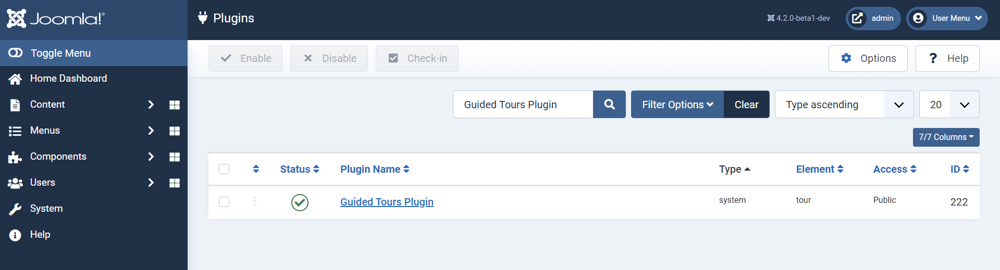
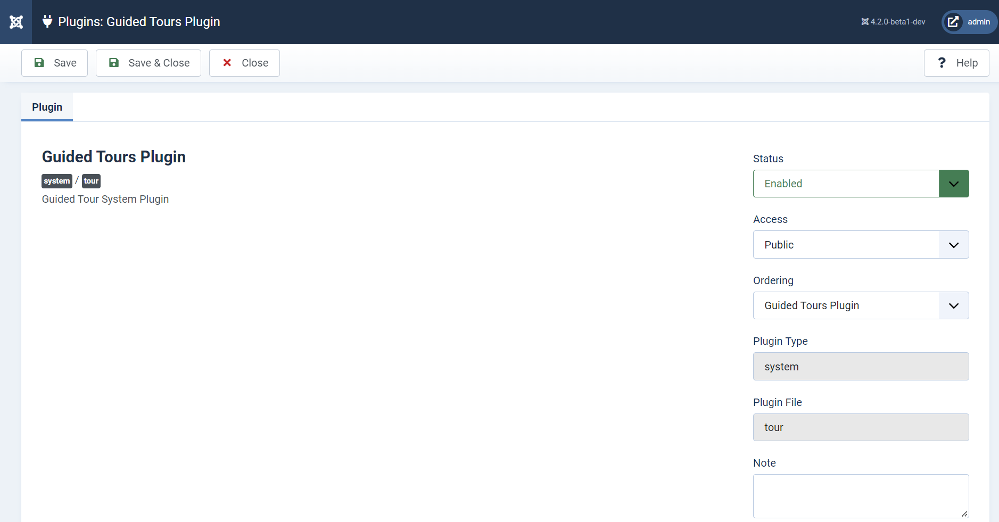
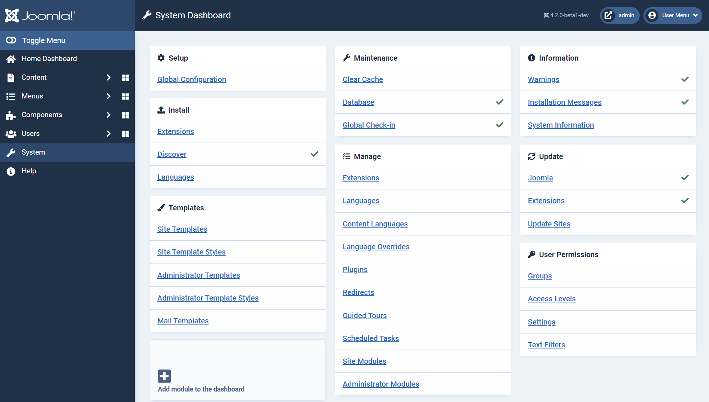
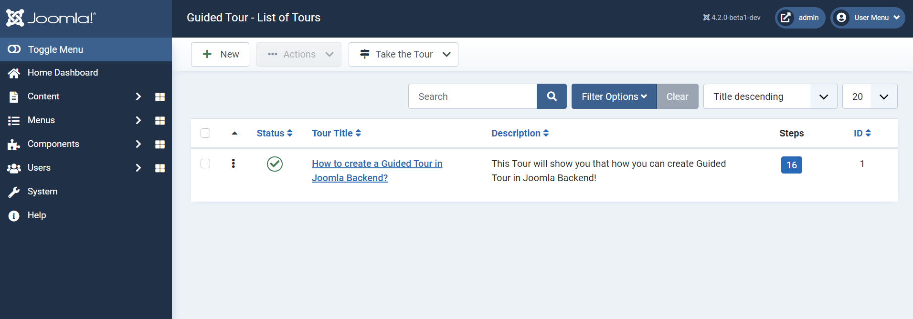
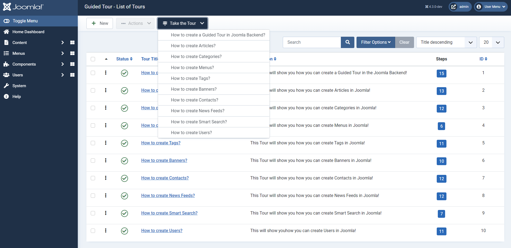
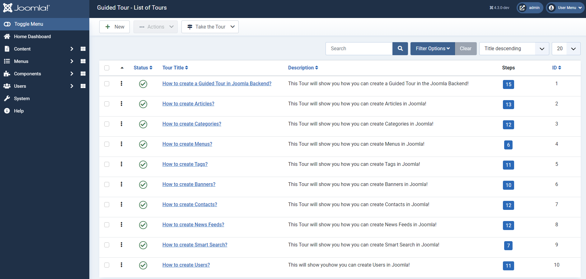
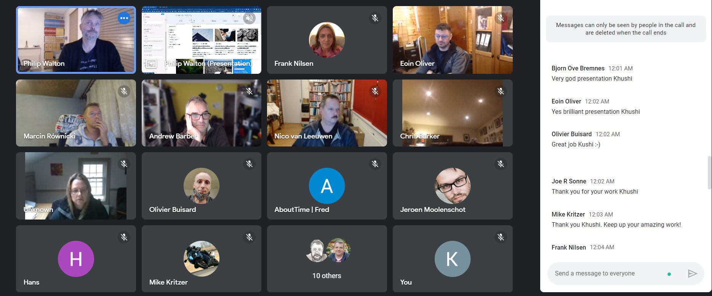

# Joomla! Guided Project Project | GSoC 2022

## Introduction
This repository contains details about my work in Google Summer of Code 2022. I have participated with Joomla! organization and worked on Guided Tour project.

<b>Project Idea :</b> [Guided Tour Project Link](https://docs.joomla.org/GSoC_2022_Project_Ideas#Project_II:_Guided_Tour) 
<b>Project Overview :</b> [Guided Tour](https://summerofcode.withgoogle.com/programs/2022/projects/XJwp022t) 
<b>Weekly Reports :</b> [Report Link](https://volunteers.joomla.org/teams/gsoc-2022-guided-tour#reports) 
<b>Open PR Link :</b> [Guided Tour Open PR Link](https://github.com/joomla-projects/gsoc22_guided-tour/pulls) 
<b>Closed PR Link :</b> [Guided Tour Closed PR Link](https://github.com/joomla-projects/gsoc22_guided-tour/pulls?q=is%3Apr+is%3Aclosed) 
<b>Blog 1:</b> [Blog 1 Link](https://community.joomla.org/gsoc-2022/gsoc-project-khushi-rauniyar-guided-tour.html) 
<b>Blog 2:</b> [Blog 2 Link](https://docs.google.com/document/d/1sWEMDvn845k5dRVumklO4qDG279C_NkDNVMy9xyomgY/edit?usp=sharing) 
<b>Project Repository :</b> [Guided Tour Repository](https://github.com/joomla-projects/gsoc22_guided-tour) 
<b>Joomla CMS Repository:</b> [Joomla Repository Link](https://github.com/joomla/joomla-cms) 

  

### Overview

For Joomla, the convenience of its users is on its priority list and Guided Tour is something that will definitely make it easy for its users to use Joomla. Those who use Joomla! will prefer a basic help text and interface over reading bulky documentation for any action they want to execute. Though it is properly detailed in an easy manner in the documentation, the user has to visit a separate link for documentation.  

It would be easy for the user if he/she can get that on the same page without any redirection and in the form of some iframes. It could be better if this would be a complete tour of the click-through path as that will increase the convenience for users in a much more professional and better way and even to make this feature more user friendly, a user can create custom tours as per the requirement. Along, with this there is feature of interactive-tour where we can create tours simultaneously along with the execution of Guided Tour. 

### Guided Tour Plugin
Go to System Dashboard > Manage module > Plugins > Guided Tours Plugin

  

### Guided Tour Plugin Overview

  

### Guided Tour Overview
Go to System Dashboard > Manage module > Guided Tours

  
  

  

### Default Tours Overview

  
  

  

## Working Interactive Guided Tour
https://user-images.githubusercontent.com/60094678/203100520-bef9d2ab-f202-455d-a9c2-e1e82fb319dd.mp4

## Working Guided Tour (click-through path)
https://user-images.githubusercontent.com/60094678/203102965-4559f57b-b409-45f9-bc8c-40ae97062bdf.mp4

## Joomla User Group London (JUGL) Presentation:

  
  

I got an opportunity to present my work done for Guided Tour project in front of a global audience as a part of the Joomla London event. It was a great opportunity and full of learnings for me to present a live demo of the project in front of a global audience.

## Work done in the Guided Tour Project

### Week 1

#### Discussions Done in the week:
- Discussed the Guided Tour project priorities and deliverables.
- Discussed the timeline and scope of the project.
- Discussed project repository setup.
- Meeting held on G-Meet with Administrator Benjamin and Mentors Jatin and Freyam.

#### Tasks completed in the week:
- Done with the setup of the project on my local machine.
- Included Joomla Coding Standards (PHP CodeSniffer) in the project.
- Worked on creating the base structure for the guided tour by taking references from the SoC project.
- Created MVC component, Added files in Model, View and Controller.
- Created SQL files for the guided tour.
- Created Plugin for Guided Tour and created a basic tour for “Creating Guided Tour in Joomla Backend”
- Prioritized the task for next week.

<b>Pull Request:</b> https://github.com/joomla-projects/gsoc22_guided-tour/pull/1

### Week 2

#### Tasks completed in the week:
- Fixed “Save2new” in the step section for each tour.
- Fixed the “Save as Copy” button in the step section which was causing the error.
- Got an understanding of the Script file for Guided Tour.
- Debugged the script file code.
- Fixed one major problem in the code, which was that every time when the tour was started it was ending at step-1 of every tour and the complete button was showing up (even if we have 10 steps in that). 
- Created a working single-page tour with all the steps.
- The main changes in the script file from the original script in the PR is Removed the `Back button` from the very first step as we don't need the back button in the first step.
- Also, earlier the tour was showing a `Complete button` after the second step even if that tour consisted of 10 steps. So, I have solved the problem and it is working properly.
- Removed the Back button redundant code.
- Prioritised the task for next week.

<b>Pull Request:</b> https://github.com/joomla-projects/gsoc22_guided-tour/pull/3

### Week 3

#### Tasks completed in the week:
- Debugged the code and solved the problem of the steps URL which was not working earlier.
- Conducted G-Meets with Mentor - Freyam where I helped him to set up the Guided Tour project for Joomla! so that he can get started with the project and start testing it.
- Attached the Steps URL in `tour.addStep` by using  `url: obj[mainID].steps[index].url` and got the steps URL for each step of the tour.
- Used session storage and URL re-direction through the `window.location.href`.
- Made one-time URL redirection of Guided Tour functionality.
- If the page is refreshed in between the steps, then by using session storage fixed the normal flow of the remaining steps from which it was refreshed.
- Implemented the code for showing the Complete Button at the last step of every tour even after the page is refreshed.
- Worked on fixing the problem i.e if click on any tour and start the tour then (if it is a multi-page tour) then after finishing the tour when we return to the main page or when we create any other tour and return to the main page where all the tours are mentioned, the relative URL of the page is changed from `option=com_guidedtours` to `option=com_guidedtours&view=tours` which was causing the problem that the tour was starting when we were clicking on that 2 times. So, I have fixed the problem by changing the relative URL of the tours page to `option=com_guidedtours&view=tours` permanently.
- Made some minor changes in `extensions.sql` for better UI.
- Changed the URL for each tour and step to the localhost URL to ensure that the steps are working properly while starting any tour.
- Working on multi-page redirection of Guided Tour.
- Prioritised the task for next week.

<b>Pull Request:</b> https://github.com/joomla-projects/gsoc22_guided-tour/pull/3

### Week 4

#### Tasks completed in the week:
- Wrote the code to make working steps for tours even if we delete some steps in between from any tour.
- Made the script file code more generic which can be applicable for all the tours.
- Removed redundant code and made functions which can be used again where the same code was present.
- Modularized and re-written the entire script file.
- Optimized and removed the unused code from the script file and reduced the number of lines from 218 to 162 lines of code for the script file.
- Solved the problem of stepID, where I took ID of steps and Tours and then used its index to traverse it.
- Created the multi-page re-direction of the tours for Guided Tour properly working.
- Wrote the code to make the tour work from any page, i.e if we start the "How to Make Article" tour from any of the pages in Joomla!, it will be re-directed to the Article page and the tour will be started. (We now don't need to click it two times to start the tour if it is present on any other Page).
- Made the Overlay Option permanently true for every tour in the code.
- Worked on the URL of the Tours Page and fixed the URL to `option=com_guidedtours&view=tours` to make the URL generic by making changes in `HtmlView.php`.
- Conducted G-Meet with Mentor - Jatin and discussed the work done till now and regarding the plan for upcoming weeks, how the journey has been so far and if there is any problem which I am facing.
- Solved one of the Major problems of `Relative URL` and make the Guided Tour properly functional through relative URL.
- Removed `https://` from the URL which was automatically getting saved in the URL field with the relative URL to make the tour work properly.
- Started working on Back Button for Multi-Page.
- Prioritised the task for next week.

<b>Pull Request:</b> https://github.com/joomla-projects/gsoc22_guided-tour/pull/3  
 https://github.com/joomla-projects/gsoc22_guided-tour/pull/4

### Week 5

#### Tasks completed in the week:
- Created Table structure for Guided Tours and Guided Tour Steps Table in `extensions.sql` for Postgresql.
- Wrote the query for dumping data in Guided Tours and Guided Tour Steps Table in `extensions.sql` for Postgresql.
- Dumped data for Guided Tours in extensions and assets Table for Postgresql by making changes in `base.sql` for Postgresql.
- Included URL parameter in update SQL scripts for Postgresql.
- Fixed the problem of Archived where while archiving any tour earlier it was showing us the `COM_GUIDEDTOURS_N_ITEMS_ARCHIVED` instead of showing us the string.
- Worked on the Back Button (which was one of the main problems for Multi-Page functionality) of the Guided Tour Popper and made the Back Button functional for multi-page as well.
- Prioritised the task for next week.

<b>Pull Request:</b> https://github.com/joomla-projects/gsoc22_guided-tour/pull/4

### Week 6 & 7

#### Tasks completed in the week:
- Merged PR [#3](https://github.com/joomla-projects/gsoc22_guided-tour/pull/3) and [#4](https://github.com/joomla-projects/gsoc22_guided-tour/pull/4).
- Solved Merge Conflicts.
- Updated all the branches according to `4.3-dev`.
- Optimized the update SQL scripts for Postgresql and MySql.
- Converted 2 Update SQL Scripts for Postgresql and MySQL into one.
- Removed Label from Hidden Field.
- Done Code Cleanup in the project.
- Started working on the issue mentioned by Christiane on [#1](https://github.com/joomla-projects/gsoc22_guided-tour/pull/1).
- Update String Value for Relative URL and added hint in the field URL as an example for a better UX.
- Resolved the comments of Benjamin on [#6](https://github.com/joomla-projects/gsoc22_guided-tour/pull/6).
- Increase the file version to 4.3 for Update SQL Scripts for Postgresql and MySQL.
- Updated to new PSR 12 Coding Standards.
- Used PSR 12 Coding standards and done code cleanup in the branch.
- Prioritized the task for next week.

<b>Pull Request:</b> https://github.com/joomla-projects/gsoc22_guided-tour/pull/6  
https://github.com/joomla-projects/gsoc22_guided-tour/pull/1

### Week 8 & 9

#### Tasks completed in the week:
- Followed PSR 12 Coding Standards in the project.
- Resolved the PHPCS Errors from logs for getting the build tests passed.
- Fixed the PHPCS Warnings from logs for getting the build tests passed.
- Used Standard Headings for the Views and removed the tour id from the title in the steps view.
- Removed the Overlay Option altogether from everywhere.
- Resolved the comments for code cleanup by Brianteeman on [#6](https://github.com/joomla-projects/gsoc22_guided-tour/pull/6).
- Changed String value for tours and steps.
- Replaced array function with shorthand array assignment in the entire project.
- Fixed the indentation problem where ever required in the entire project.
- Replaced Hard Coded Strings with Language Strings in the code.
- Did code cleanup in the tour.xml and step.xml files.
- Done Code Cleanup in the project.
- Prioritized the task for next week.

<b>Pull Request:</b> https://github.com/joomla-projects/gsoc22_guided-tour/pull/6  
https://github.com/joomla-projects/gsoc22_guided-tour/pull/1

### Week 10 & 11

#### Tasks completed in the week:
- Removed Unused index for PostgreSQL.
- Deep dive into the code base for understanding how PostgreSQL files are implemented.
- Solved errors for PostgreSQL for getting build tests passed.
- Understand the PR [#10](https://github.com/joomla-projects/gsoc22_guided-tour/pull/10) created by Richard for SQL Fixes.
- Solved one of the major problems by adding tour_id on the step view URL i.e while submitting the form for creating the steps.
- Worked on solving the Filtering of steps (ex- Published/Unpublished) according to the particular tour.
- Started working on creating the default tours which will be packaged with Joomla Basic tours required for the project.
- Worked on understanding and creating the flow of default tours for different components i.e. Guided Tour Introduction, Articles, Categories, Menus, Banners and Tags.
- Created completely working default tours for Guided Tour Introduction, Articles, Categories, Menus, Banners and Tags components.
- Created PR [#11](https://github.com/joomla-projects/gsoc22_guided-tour/pull/11) for default tours created. 
- Conversation with Benjamin regarding the new requirements and expectations for user tour [#9](https://github.com/joomla-projects/gsoc22_guided-tour/issues/9).
- Worked on understanding the use case and started thinking of the solutions for tasks mentioned in [#9](https://github.com/joomla-projects/gsoc22_guided-tour/issues/9).
- Prioritized the task for next week.

<b>Pull Request:</b> https://github.com/joomla-projects/gsoc22_guided-tour/pull/11  
https://github.com/joomla-projects/gsoc22_guided-tour/pull/6  
https://github.com/joomla-projects/gsoc22_guided-tour/pull/1

### Week 12 & 13

#### Tasks completed in the week:
- Worked on understanding and creating the flow of default tours for different components.
- Created completely working default tours.
- Updated PR [#11](https://github.com/joomla-projects/gsoc22_guided-tour/pull/11) for default tours created that will be installed at the time of Joomla! installation.
- Renamed Next to Start in the popper of Guided Tour.
- Sync up the `default-tours` branch with the `cleanup` branch.
- Worked on solving the tasks mentioned in [#9] (https://github.com/joomla-projects/gsoc22_guided-tour/issues/9).
- Worked on making the “Next” button disabled and getting it active when something is inserted in the text box by using on change event on the respective class or id.
- Wrote Blog 2 for the final evaluation.
- Started working on the presentation for the community in the JUG London (virtual).
- Prioritized the task for next week.

<b>Pull Request:</b> https://github.com/joomla-projects/gsoc22_guided-tour/pull/11  
https://github.com/joomla-projects/gsoc22_guided-tour/pull/6  
https://github.com/joomla-projects/gsoc22_guided-tour/pull/1

### Week 14 & 15

#### Tasks completed in the week:
- Used correct Values for Created, Modified and Checked out columns in `extensions.sql` for all the tours and steps.
- Updated `extensions.sql`  file.
- Code cleanup for the `default-tours` branch.
- Added default tours for other components i.e How to create Banners and Contacts in Joomla!
- Connected with Benjamin and Philip on G-Meet to discuss further work and requirements for the project.
- Discussed the approach for creating the structure for interactive tours.
- Researched some existing form fields where after clicking on any form field, its dropdown appears.
- Worked on creating a form field called `type` containing sub-fields in it i.e Next Step, Redirect, Interactive Tours and Interaction with Form Fields.
- Used `showon` property to create sub-fields for Redirect and  Interaction with Form Fields.
- Changed default values in `step.xml`.
- Conducted another follow-up meeting with Benjamin and Philip to discuss further progress and blockers if any in the project.
- Discussed about the meeting conducted with release managers and the JUGL event.
- Prioritized the task for next week.

<b>Pull Request:</b> https://github.com/joomla-projects/gsoc22_guided-tour/pull/11  
https://github.com/joomla-projects/gsoc22_guided-tour/pull/6  
https://github.com/joomla-projects/gsoc22_guided-tour/pull/1

### Week 16 & 17

#### Tasks completed in the week:
- Added type in the list of arrays for steps.
- Added check for `Next Step` and `Redirect` field and made it work.
- Added string value for URL.
- Done changes in `extensions.sql` for adding `type` and `validation` field.
- Changed all the default tours value for `type and `validation` columns in extensions.sql.
- Sync up the branch with `4.3-dev`.
- Merged the `cleanup` branch PR [#6](https://github.com/joomla-projects/gsoc22_guided-tour/pull/6) in the `infra-guided-tour` branch and rebased the `default-tours` branch from the infra-guided-tour branch.
- Solved all the merge conflicts.
- Done PHPCS Fixes.
- Merged SQL Fixes PR [#10](https://github.com/joomla-projects/gsoc22_guided-tour/pull/10) in the `infra-guided-tour` branch and solved the merge conflicts.
- Connected with Benjamin and Philip to discuss about the progress of the project.
- Prepared for giving a presentation of the project in front of the release manager of Joomla! 
- Meeting with Release managers of Joomla! And connected with Olivier Buisard and Shirielle (SD) along with Benjamin and Philip and gave a live presentation of work done in the guided tour project.
- Started working on all the comments and code reviews by Brainteeman on PR #1.
- Prioritized the task for next week.

<b>Pull Request:</b> https://github.com/joomla-projects/gsoc22_guided-tour/pull/11  
https://github.com/joomla-projects/gsoc22_guided-tour/pull/6  
https://github.com/joomla-projects/gsoc22_guided-tour/pull/1

### Week 18 & 19

#### Tasks completed in the week:

- Worked on creating the flow and added the code for other component default tours i.e. Contact, News Feeds, Smart Search and Users.
- Worked on adding the value of `type` and `validation` in all the default tours.
- Optimised the javascript code with minimal lines of changes done to implement the functionality to produce a good quality code.
- Removed hidden field label and added string value for step title label.
- Removed hidden field for the string value.
- Done PHPCS fixes.
- Worked on thinking and brainstorming about the approach to implement the interactive tour feature which is a major feature of the project.
- Done code cleanup for `guidedtours.xml`.
- Worked on the comments and code reviews by Brainteeman on PR [#1](https://github.com/joomla-projects/gsoc22_guided-tour/pull/1).
- Overall code cleanup.
- Passed all the build tests.
- Started working on `3rd party integratio`n and brainstorming to find out an approach to implement the same.
- Came up with an approach and discussed the same with Benjamin and other mentors.
- Made a basic `guided-tour.json` file for `3rd party integration`.
- Discussed the approach with Olivier. 
- Worked on planning further tasks and prepared a timeline for the same.
- Discussed the tasks timeline with the mentors.
- Meeting with Benjamin and Philip for discussion regarding the project status and implementation of Interactive Tours.
- Worked on the presentation for the community in the JUG London (virtual).
- Gave a live presentation in front of a global audience about the Guided Tour project at the JUG London event.
- Prioritized the task for next week.

<b>Pull Request:</b> https://github.com/joomla-projects/gsoc22_guided-tour/pull/11  
https://github.com/joomla-projects/gsoc22_guided-tour/pull/1

### Week 20 & 21 & 22

#### Tasks completed in the week:
- Did brainstorming and deep diving into the solution and implemented the interactive tour onclick part i.e now we can click on the `+New` button in place of clicking on the Next Button.
- Merged `Interactive Tour` and `Interaction with Form Fileds` drop down into one dropdown i.e Interactive Tour.
- Added form fields in the tour step for an `interactive tour`.
- Changed value for interactive step field in `extensions.sql`.
- Added a new dropdown field which would be visible after selecting Interactive tour.
- Created Interactive Tour dropdown, and in that, there will be three sub-fields i.e `Button`, `Form Field` and `Others`.
- Solved the major problem for the interactive step and made the `+New Button` Work.
- Implemented the functionality, If the user selects the `Button` field then the user will be able to click the `+New button` in spite of clicking on the `Next Button` in the pop-up.
- Worked on the feature and while selecting the `Button` field the Next Button won't be visible.
- Implemented the feature and now If the user selects the `Text field` then it will disable the Next Button until someone enters any value in the field.
- Added EventListner `Click` on the target of the step for the Button field in Interactive Tour.
- Added EventListner `input` on the target of the step for Form Field.
- Done changes for default tours in `extensions.sql` for changing the value according to Interactive tour.
- Code formatting.
- Added one more field in the `Interactive step` for default values.
- Added logic in javascript for incorporating changes for adding one more field in the `Interactive step`.
- Made changes in default tours in `extensions.sql` to make it compatible with interactive tours.
- Identified and solved the problem and made two consecutive mandatory fields `Next Button` enable/disable in the `interactive step` work.
- Tested the changes done for all the default tours to ensure all the tours are working with interaction.
- Did the changes in Default tours and made improvements in interactive tours.

<b>Pull Request:</b> https://github.com/joomla-projects/gsoc22_guided-tour/pull/16  
https://github.com/joomla-projects/gsoc22_guided-tour/pull/11  
https://github.com/joomla-projects/gsoc22_guided-tour/pull/1

## Mentors

Thank you Joomla! organization mentors and org admins who have been an integral part of my journey. They have alawys been very helpful, supportive and encouraging at each and every point during the GSoC periord.

1. Benjamin Trenkle
2. Philip Walton
3. Richard Fath
4. Christiane Maier-Stadtherr
5. Patrick Jackson
6. Jatin Salve
7. Eyvaz Ahmadzada
8. Yatharth Vyas
9. Freyam Mehta
